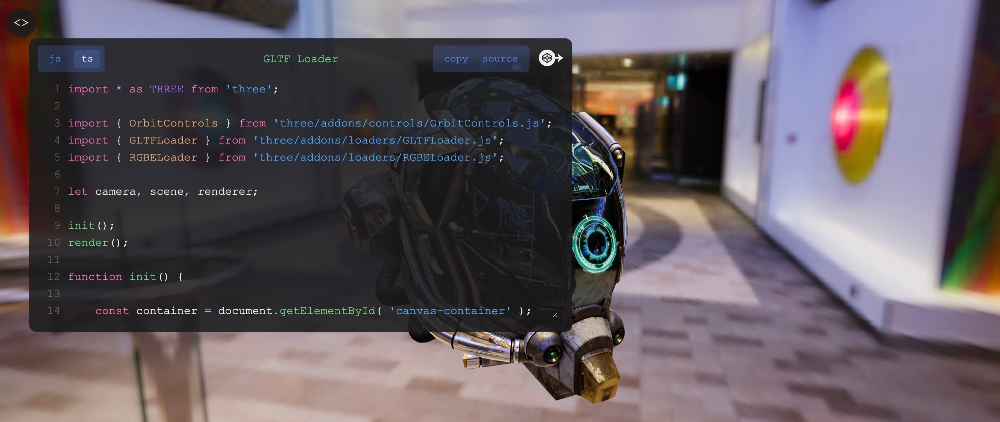

# Example Code Previewer



A minimal code viewer for html with support for syntax highlighting, multiple files, codepen prefill. 

Source code on Github: https://github.com/repalash/example-code-previewer/

## Demo

Check out the [simple](https://repalash.github.io/example-code-previewer/examples/simple.html) and [complex](https://repalash.github.io/example-code-previewer/examples/threejs.html) (with [three.js](https://threejs.org)) live demos

## Usage

```html
<script type="module">
import {setupCodePreview} from 'https://cdn.jsdelivr.net/gh/repalash/example-code-previewer/dist/index.js'

setupCodePreview(
    document.getElementById('container'),
    ['./script.js', './script.ts'], // scripts
    ['js', 'ts'],
    ['https://github.com/repalash/example-code-previewer/tree/master/examples/script.js', 'https://github.com/repalash/example-code-previewer/tree/master/examples/script.ts'], // links (source/github/gitlab etc)
    (c)=> c + `\n // Append some code here`,
    { // for codepen
        title: 'Example: ' + document.title,
        css: document.getElementById('example-style').textContent,
    },
).then(actions=>{
    // close when the container is clicked
    document.querySelector('#container').addEventListener('click', (e)=> e.target.id==='container' && actions.close())
})
</script>
```

## Development
Build for development (Build and watch): 
```bash
npm run dev
```
To serve the local build and examples, run 
```bash
npm run serve
```


Build for production (Build): 
```bash
npm run build
```

Generate a new version
```bash
npm version
```

## License
MIT

## References
Syntax highlighting with [Speed highlight JS](https://github.com/speed-highlight/core)
Generated with [rollup-library-starter](https://github.com/repalash/rollup-library-starter)
